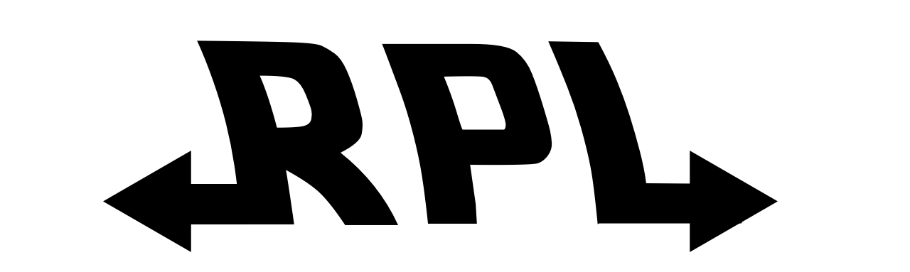

`rpl` for the future and past. An alternative to the `node` default
REPL (what you access when you just call `node` and can type in lines of code).

The main trick is that this supports time travel. You can instrument code
calls by using special comments, and edit previous code, changing future values.

Try:

```js
var a = 2;
//=a
```

It also supports async instrumentation, since node is node.

```js
require('fs').readFile('/etc/hosts', 'utf8', function(err, res) {
  //=res
});
```

## install

    npm install -g rpl

## hack on a blank page

    rpl && open http://localhost:3000/

## hack on file

    rpl foo.js && open http://localhost:3000/

## see also

`rpl` is the sibling of [mistakes.io](http://mistakes.io/), something
that does something similar but in browsers instead of node and implicitly
instead of explicitly.
