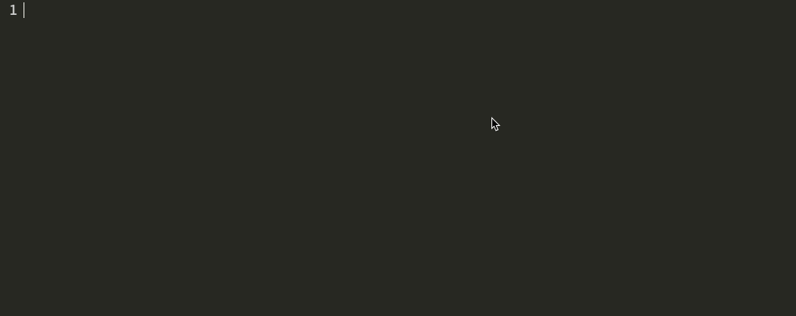

[](http://travis-ci.org/tmcw/rpl)

`rpl` for the future and past. An alternative to the `node` default
REPL (what you access when you just call `node` and can type in lines of code).

## Install

    npm install -g rpl

The main trick is that this supports time travel. You can instrument code
calls by using special comments, and edit previous code, changing future values.


It also supports async instrumentation, since node is node.




```js
require('fs').readFile('/etc/hosts', 'utf8', function(err, res) {
  //=res
});
```

## the binary

```
rpl [-b] [-o] [FILENAME]
      ^   ^    ^
      |   |    |
      |   |    | prefill the cli with the contents of a file
      |   |
      |   | -b open your browser to the page
      |
      | -b open a chrome app standalone window
```

## getting started

`rpl` is a node module you install globally. When you run `rpl`, it starts
up a server at `http://localhost:3000/`, so you'll need to open your browser
to that page. From there you just type, and when you want to inspect a value,
add a comment to your source code like:

```js
//=variableName
```

You can also type expressions there, like:

```js
//=Date()
```

You can use `require()` just like you would elsewhere, and, like the node
REPL, `require()` calls become relative to the current working directory.

## see also

`rpl` is the sibling of [mistakes.io](http://mistakes.io/), something
that does something similar but in browsers instead of node and implicitly
instead of explicitly.
